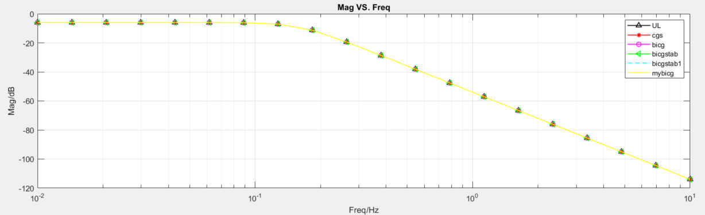

# Matlab线性方程求解(SolveSystemOfLinearEquations)
> 这是一个Matlab版本的线性方程求解迭代算法，目的是为了进行仿真验证，主要有UL分解(直接法)和BiCG(迭代法)，并且为以后梯形网络优化打基础，更多可以关注微信公众号"[电路设计小工具](https://mp.weixin.qq.com/s/fxfEnir-hU0YvF9_CWyI6g)".

### 如何使用(how to use)
下载这7个文件： \
 \
顶层文件(Top file)： \
eTools_SSOLE_Top.m(单频点) \
eTools_SSOLE_Sweep_Top.m(频点扫描)

### 运行环境(Env)
win10, Matlab2021a

### 运行效果(demo)
以下参数为一个3阶Butterworth低通滤波器的设计参数。  
- 单频率点： \
 \
可以看到PCG不收敛，BiCGSTAB也没有收敛（只在这一特殊频率点上不收敛）。 
- 频率扫描： \

### 参考(ref)
[1] : [模拟无源滤波器设计（一）](https://mp.weixin.qq.com/s/wNRHyBHpimjU90bymHp7JA) \
[2] : [模拟无源滤波器设计（二）](https://mp.weixin.qq.com/s/3GMQs4WDm683tdAXqyoOgQ) \
[3] : [欢迎关注电路设计小工具公众号](https://mp.weixin.qq.com/s/fxfEnir-hU0YvF9_CWyI6g)

